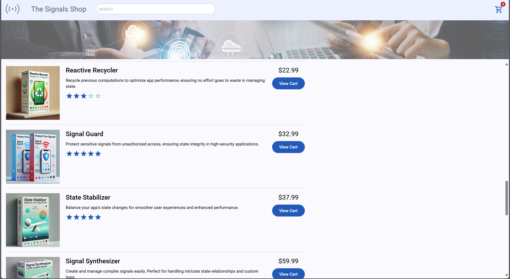
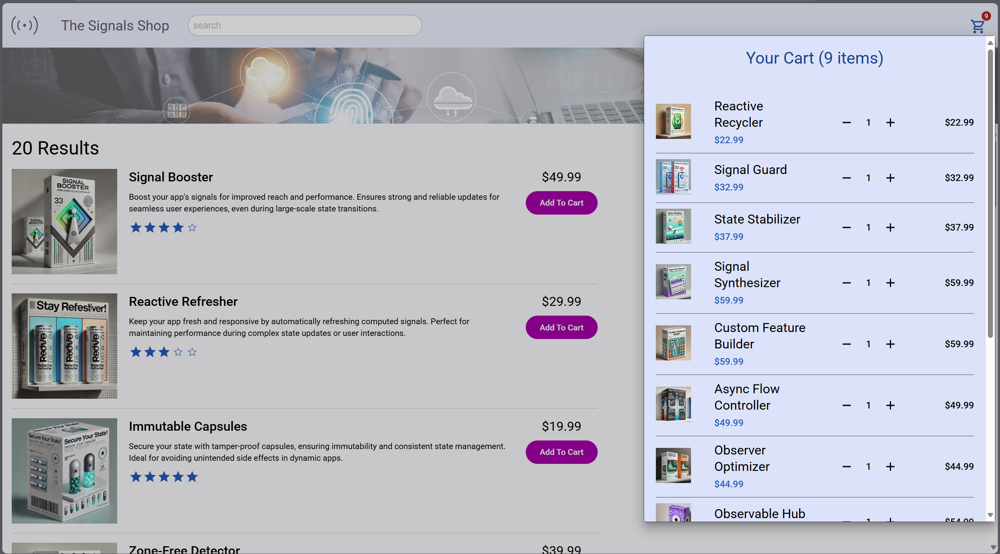

# The Signals Shop - Angular E-Commerce App

  
  

## 🚀 Project Overview

The Signals Shop is a modern Angular e-commerce application showcasing state-of-the-art signal management tools with a clean, reactive UI. Built with Angular's latest features including SignalStore for state management.

## ✨ Key Features

### 🛍️ Product Catalog

- Browse 20+ specialized signal management tools
- Search and filter products
- Star rating display (★★★★☆)
- Clean card-based layout with pricing

### 🛒 Shopping Cart

- Add/remove products with +/- controls
- Real-time quantity updates
- Persistent cart state
- Clear pricing breakdown

### ⚡ State Management

- Powered by **NgRx SignalStore**
- Reactive updates without unnecessary re-renders
- Immutable state handling
- Zone-free change detection

## 🛠️ Technical Stack

| Category         | Technology       |
| ---------------- | ---------------- |
| Framework        | Angular 17+      |
| State Management | NgRx SignalStore |
| UI Components    | Angular Material |
| Styling          | SCSS + Tailwind  |
| Build Tool       | Vite/Angular CLI |
