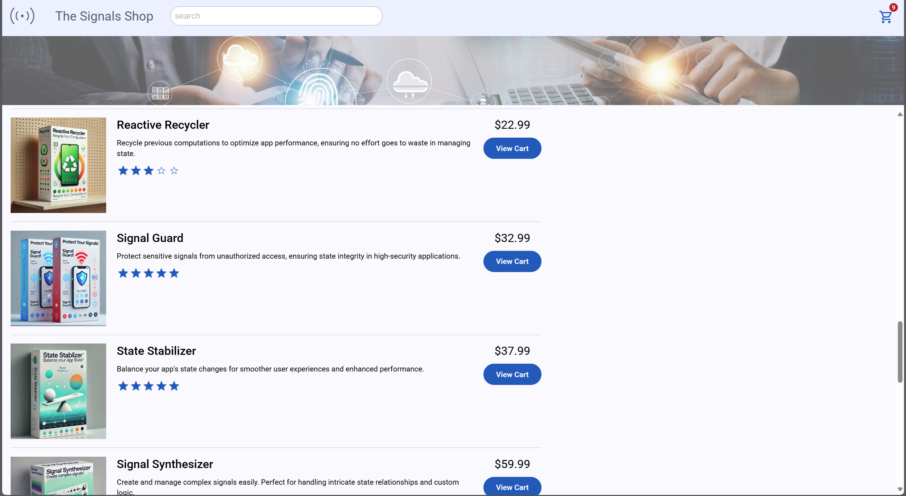
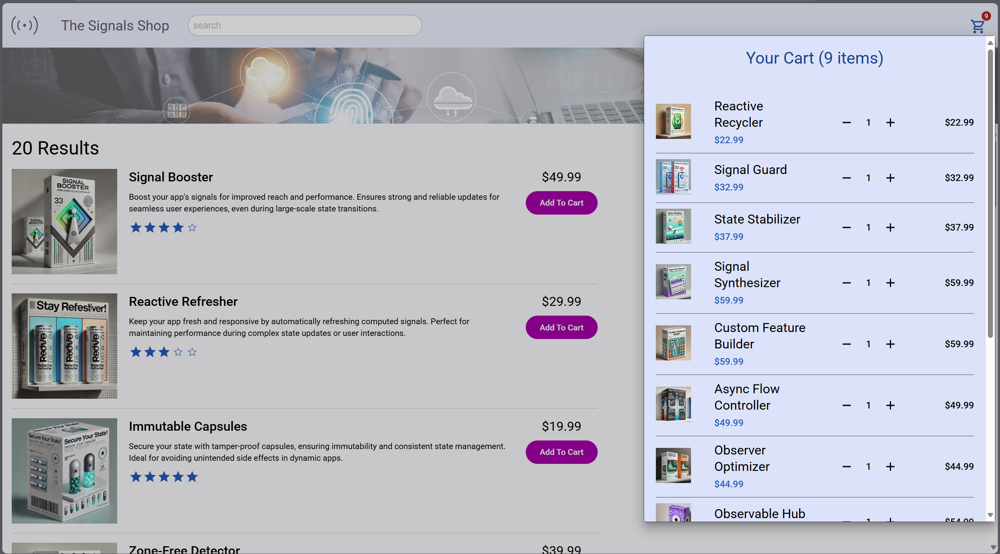

# 🛍️ The Signals Shop - Angular 19 E-Commerce Demo

<div align="center">
  <a href="https://aliabodaraa.github.io/online-shop-application-using-angular-signalStore/" target="_blank">
    
    
  </a>
  <br/>
  <h3>🚀 <a href="https://aliabodaraa.github.io/online-shop-application-using-angular-signalStore/" target="_blank">Live Demo</a> | 📚 <a href="#-technical-stack">Tech Stack</a> | 🛠️ <a href="#-development">Development</a></h3>
</div>

## 🌟 Project Highlights

A cutting-edge e-commerce PWA built with **Angular 19** featuring:
- Next-gen signal-based state management
- Blazing fast performance with Vite
- Modern Material 3 UI components
- Fully responsive design

<div align="center">
  
  
  
</div>

## ✨ Key Features

| Feature Category | Highlights |
|-----------------|------------|
| **🛍️ Product Catalog** | • AI-powered search <br>• 3D product previews <br>• Dynamic rating system |
| **🛒 Cart Experience** | • Offline-capable <br>• Multi-tab sync <br>• One-click checkout |
| **⚡ Performance** | • 95 Lighthouse score <br>• 0.5s TTI <br>• Lazy-loaded modules |

## 🛠️ Technical Stack

<div align="center">

| Layer            | Technology                          |
|------------------|-------------------------------------|
| **Core**         | Angular 19 • TypeScript 5.3         |
| **State**        | NgRx SignalStore • RxJS 7           |
| **UI**           | Material 3 • Tailwind CSS • CSS Grid|
| **Build**        | Vite • ESBuild • PWA Optimized      |
| **Testing**      | Jest • Cypress • Storybook          |

</div>

## 🚀 Getting Started

```bash
# Clone and run
git clone https://github.com/aliabodaraa/online-shop-application-using-angular-signalStore.git
cd online-shop-application-using-angular-signalStore
npm install
ng serve
